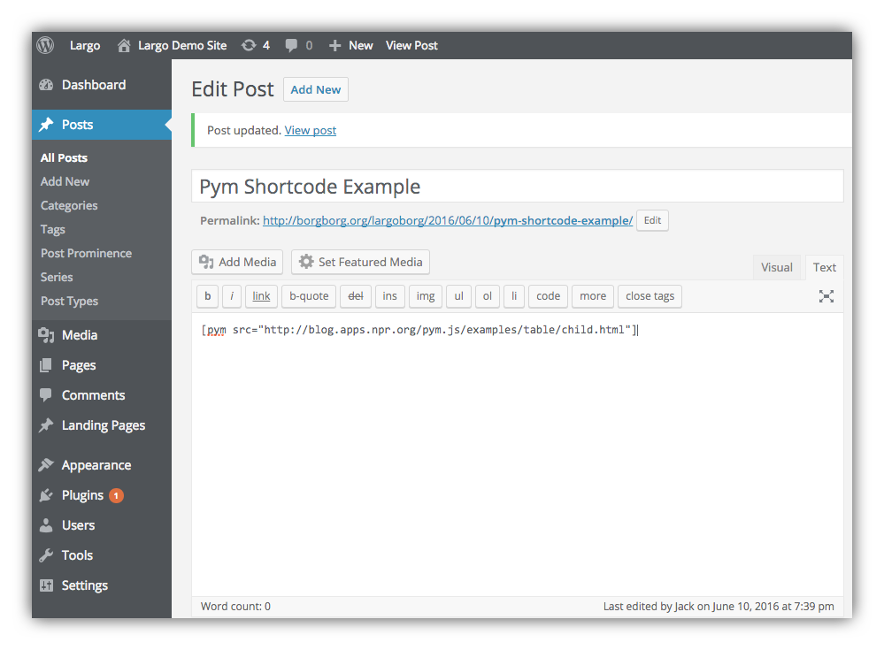
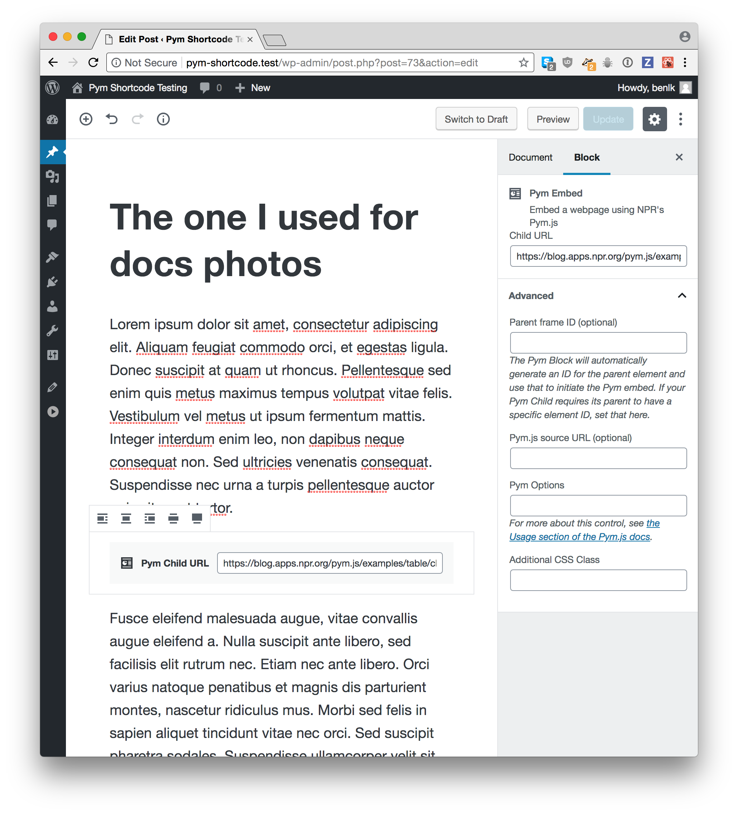
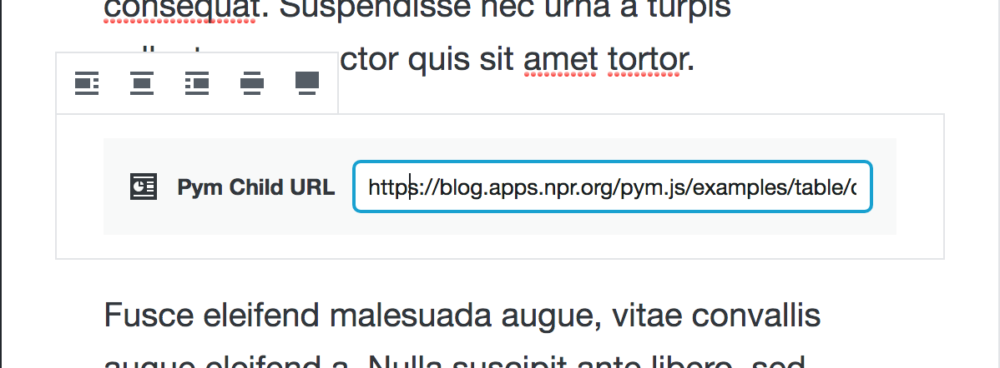

# Pym Shortcode

Pym Shortcode will responsively resize an iframe's height depending on the width of its container. The plugin uses [Pym.js](http://blog.apps.npr.org/pym.js/), developed by the [NPR Visuals Team](http://blog.apps.npr.org/), to allow embedded content in WordPress posts and pages using a simple shortcode. Using `Pym.js`, it bypasses the usual cross-domain issues.

Contents:

1. [Plugin Installation](#plugin-installation)
2. [The Pym Shortcode](#the-pym-shortcode)
3. [The Pym Block](#the-pym-block)
4. [Options](#options)
	1. src
	2. pymsrc
	3. pymoptions
	4. class
	5. align
	6. id
5. [Frequently Asked Questions](#frequently-asked-questions)
	1. [Why would I want to use Pym in the first place?](#why-would-i-want-to-use-pym-in-the-first-place)
	2. [Why is a WordPress plugin needed to use Pym.js?](#why-is-a-wordpress-plugin-needed-to-use-pymjs)
	3. [When would I use a Pym.js solution versus embed code without using Pym.js?](#when-would-i-use-a-pymjs-solution-versus-embed-code-without-using-pymjs)
	4. [Is Pym.js or this plugin dependent on jQuery or any other library?](#is-pymjs-or-this-plugin-dependent-on-jquery-or-any-other-library)
	5. [What is the URL for pym.v1.min.js?](#what-is-the-url-for-pymv1minjs)
	6. [Why would I want to change the Pym.js source URL?](#why-would-i-want-to-change-the-pymjs-source-url)
	7. [I've set a different pymsrc option, but now I'm seeing a message in the console](#ive-set-a-different-pymsrc-option-but-now-im-seeing-a-message-in-the-console)
	8. [How do I serve Pym.js if the embedded page uses HTTPS and my site does not?](#how-do-i-serve-pymjs-if-the-embedded-page-uses-https-and-my-site-does-not)
	9. [How do I know if there's an HTTPS problem with a given embedded iframe?](#how-do-i-know-if-theres-an-https-problem-with-a-given-embedded-iframe)
	10. [What license is this plugin licensed under?](#what-license-is-this-plugin-licensed-under)
6. [Other Pym Resources](#other-pym-resources)

## Plugin Installation

1. In the WordPress Dashboard go to **Plugins**, then click the **Add Plugins** button and search the WordPress Plugins Directory for Pym Shortcode. Alternatively, you can download the zip file from this Github repo and upload it manually to your WordPress site.
2. Activate the plugin through the 'Plugins' screen in WordPress
3. Nothing to configure, just begin using Pym Shortcode!

## The Pym Shortcode

In a WordPress post or page use Pym Shortcode like this:

`[pym src="https://blog.apps.npr.org/pym.js/examples/table/child.html"]`

Example in a post:



## The Pym Block

Example in a post:



For the block, all options available via shortcode arguments are available through the block's advanced options panel.

## Options

```
[pym src="" pymsrc="" pymoptions="" class="" align="" id="" ]
```

### `src`, the child URL

`src` is the URL of the page that is to be embedded. In these examples, we use https://blog.apps.npr.org/pym.js/examples/table/child.html, the source code for which can be found at https://github.com/nprapps/pym.js/tree/master/examples/table .

For the shortcode, `src` is the only required parameter.

```
[pym src="https://blog.apps.npr.org/pym.js/examples/table/child.html"]
```

Here's what the setting looks like in a block:



### `pymsrc`, the URL for pym.js

`pymsrc` is optional; only set this if you need to specify a different source for `Pym.js` than the default. The default `Pym.js` source URL is `js/pym.v1.min.js` in this plugin's directory on your server. [NPR recommends](http://blog.apps.npr.org/pym.js/#get-pym-cdn) that you use the CDN version of `Pym.js` in most cases, which is available at `https://pym.nprapps.org/pym.v1.min.js`. An example shortcode using this option is as follows:

```
[pym src="https://blog.apps.npr.org/pym.js/examples/table/child.html" pymsrc="https://pym.nprapps.org/pym.v1.min.js"]
```

### `pymoptions`, settings for Pym

`pymoptions` is optional; this should be a javascript object without the surrounding `{}`, and is given in the event that options need to be passed to the `pymParent`. NPR gives [this example](http://blog.apps.npr.org/pym.js/#examples) javascript:

```js
pym.Parent('example', 'https://blog.apps.npr.org/pym.js/examples/table/child.html', { xdomain: '*\.npr\.org' });
```

To do the same thing with this Pym shortcode, you would write:

```
[pym src="https://blog.apps.npr.org/pym.js/examples/table/child.html" pymoptions=" xdomain: '\\*\.npr\.org' "]
```

### `class`, to add HTML classes to the Pym parent element

`class` is optional; this should be a valid HTML class name. It will be added to the element's default class, `'pym'`. You would want to use this if, for example, you wanted to [use a size-based class name to determine the size of the embed on your site](https://github.com/INN/pym-shortcode/issues/23). The class `'pym'` will always be output on container elements created by the Pym Shortcode. This class was introduced in version 1.2.2.

For example, the shortcode `[pym src="https://blog.apps.npr.org/pym.js/examples/table/child.html" class="one two three four float-left mw_50"]` results in the following output:

```html
<div id="pym_0" class="pym one two three four float-left mw_50"></div><script src="http://example.org/wp-content/plugins/pym-shortcode/js/pym.v1.min.js"></script><script>var pym_0 = new pym.Parent('pym_0', 'https://blog.apps.npr.org/pym.js/examples/table/child.html', {})</script>
```

If you do not want the class `'pym'` output on container elements, [add a filter](https://codex.wordpress.org/Plugin_API/Filter_Reference) to the hook `pym_shortcode_default_class` that returns an empty string.

### `align`, for WordPress alignment support

`align` is optional; this should be one of the [WordPress-provided generated alignment types](https://codex.wordpress.org/CSS#WordPress_Generated_Classes): `left`, `right`, `center`, `none`. If your theme supports the `wide` or `full` values, you can use those too, as the value provided here will be prefixed with `align` and output as a CSS class on the Pym parent, so that the shortcode `[pym align="foo"]` results in the output `<div id="pym_0" class="pym alignfoo ">...`

In the Gutenberg editor, the alignment options are provided by the alignment controls that appear when the block is selected. The default choice is "none", with no option selected, and the other options are to align it left, center, or right. If your theme [declares support for the "wide" alignment](https://wordpress.org/gutenberg/handbook/extensibility/theme-support/#wide-alignment), you'll also see options for "wide" and "full" widths. The appearance of these alignment options on the page will depend on your site's theme.


### `id`, to set the Pym parent element's ID

`id` is optional; this should be a valid HTML element ID name. It will be used as the ID of your `pymParent` iframe on the parent page. You would want to use this if, for example, [your embedded page contained navigation to another page, requiring the second page to know the pymParent element ID](https://github.com/INN/pym-shortcode/issues/20).

For example, the shortcode `[pym src="https://blog.apps.npr.org/pym.js/examples/table/child.html" id="extremely_specific_id"]` results in the following output:

```html
<div id="extremely_specific_id" class="pym"></div><script src="http://example.org/wp-content/plugins/pym-shortcode/js/pym.v1.min.js"></script><script>var pym_0 = new pym.Parent('extremely_specific_example', 'https://blog.apps.npr.org/pym.js/examples/table/child.html', {})</script>
```

## Frequently Asked Questions

### Why would I want to use Pym in the first place?

Using iframes in a responsive page can be frustrating. It’s easy enough to make an iframe’s width span 100% of its container, but sizing its height is tricky — especially if the content of the iframe changes height depending on page width (for example, because of text wrapping or media queries) or events within the iframe. For more information, see [NPR's documentation for `Pym.js`](http://blog.apps.npr.org/pym.js).

### Why is a WordPress plugin needed to use `Pym.js`?

Normally WordPress strips out JavaScript inserted in posts and pages, so the usual HTML `Pym.js` embed code's `<script>` tag won't work. Pym Shortcode simply provides a wrapper around `Pym.js` so you can embed anything you'd use `Pym.js` for by using WordPress shortcode.

### When would I use a `Pym.js` solution versus embed code without using `Pym.js`?

If you're embedding a YouTube video or a SoundCloud audio player, you don't need `Pym.js` and in fact, you would not want to use it. WordPress supports many embeds through [oEmbed](https://codex.wordpress.org/Embeds). To make these commodity types of embeds responsive, you may need to add CSS rules depending on your theme. They won't be resized by this plugin.

You would want to use Pym for other types of content you create and embed using iframes such as tables, charts, and interactive elements. For example, news organizations often create data-driven visualizations that are hosted in another application and need to be iframed into their CMS.

For the Pym shortcode or the Pym block to work, the `Pym.js` JavaScript library must be used on the embedded page, referred to as the "child page". You can use this plugin's shortcode or block to embed content from any page that is so enabled. For information on how to use `Pym.js` in your projects, see [NPR's `Pym.js` documentation](http://blog.apps.npr.org/pym.js/#examples).

### Is `Pym.js` or this plugin dependent on jQuery or any other library?

Nope, all the required JavaScript is self-contained in the plugin-provided copy of `pym.v1.min.js`. The shortcode will enqueue `pym.v1.min.js` when necessary. You will need to include `pym.v1.min.js` on the embedded page, however.

### What is the URL for `pym.v1.min.js`?

Assuming that you have installed this plugin via the wordpress.org plugin repository and that your site is `https://example.org/`, you'll find `pym.v1.min.js` at `https://example.org/wp-content/plugins/pym-shortcode/js/pym.v1.min.js` .

You can check the validity of that assumption by putting a shortcode or block in a post, then viewing the post from the frontend. In the source code of the page, you should see a script tag loading `pym.v1.min.js`. 

Or, you can specify the URL from which to load `Pym.js`.

### Why would I want to change the `Pym.js` source URL?

There are several reasons why you might want to change the version of `Pym.js` used to embed a webpage. For example:

- The embedded page uses an older version of `Pym.js`
- The embedded page is loaded over HTTPS but your website is not, so `Pym.js` must be loaded over HTTPS to communicate with the child
- The embedded page uses a modified version of `Pym.js`
- For ease of development, you've standardized on the CDN-served copy of `Pym.js`

In any of these cases, set the different version of `Pym.js` using the `pymsrc` option in the shortcode:

```
[pym src="https://blog.apps.npr.org/pym.js/examples/table/child.html" pymsrc="https://pym.nprapps.org/pym.v1.min.js" pymoptions=""]
```

### I've set a different `pymsrc` option, but now I'm seeing a message in the console

If a post has multiple instances of the Pym shortcode or block present, and between those different Pym instances there are different source URLs for `Pym.js` specified, then you should expect to see a message like the following in the browser's console when viewing that page:

> Hi Pym user! It looks like your post has multiple values for pymsrc for the blocks and shortcodes in use on this page. This may be causing problems for your Pym embeds. For more details, see https://github.com/INN/pym-shortcode/tree/master/docs#ive-set-a-different-pymsrc-option-but-now-im-seeing-a-message-in-the-console"

If your server is running with [`WP_DEBUG` set to `true`](https://codex.wordpress.org/WP_DEBUG), then your server console will also contain a message like this:

```
PHP message: post 5: There are more than one pym source URLs set on this page! The list: array (
  0 => 'http://example.org/wp-content/plugins/pym-shortcode/js/pym.v1.min.js',
  1 => 'https://pym.nprapps.org/pym.v1.js',
)
```

This message is included to make the process of debugging your content easier.

To remedy this issue, take the following steps:

1. Make sure every `[pym]` shortcode in the page has the same `pymsrc=""` attribute
2. Make sure that every Pym Embed block on the page has the same URL set in the block settings for the "Pym.js URL" option.

If your post has a mix of Pym shortcodes and blocks, you'll need to make sure that both types of Pym embed on the page use the same source URL.

### How do I serve `Pym.js` if the embedded page uses HTTPS and my site does not?

If the embedded page's domain has an SSL certificate and is loaded over HTTPS, and if your site is loaded over plain HTTP, then the `Pym.js` script on your page will not be able to talk to the `Pym.js` script in the embedded page. This can be fixed by making sure your site loads over HTTPS, or by specifying an alternate source for your `Pym.js` script.

The default `Pym.js` source URL is `js/pym.v1.min.js` in this plugin's folder, served by whatever protocol your site is using. You can change the source by using the `pymsrc` parameter in the shortcode, for example, an HTTPS-using CDN source like `https://pym.nprapps.org/pym.v1.min.js`:

```
[pym src="https://blog.apps.npr.org/pym.js/examples/table/child.html" pymsrc="https://pym.nprapps.org/pym.v1.min.js" pymoptions=""]
```

The URL provided above is the [official content delivery network (CDN) for Pym](http://blog.apps.npr.org/pym.js/#get-pym-cdn). If you're hosting your embed on an HTTPS domain, you can also host your copy of `Pym.js` there and use that URL.

### How do I know if there's an HTTPS problem with a given embedded iframe?

If the embed isn't resizing correctly (especially vertically), the `Pym.js` script may not be loading correctly.

You can determine if the embed is being served over HTTPS by opening the embed in a new tab and looking at the protocol in its URL to see if it's `https://` instead of `http://`. To open the embed in a new tab, try right-clicking on the embed and choosing "Open frame in new tab" or a similar option.

You can also check by opening your browser's developer tools and looking in the console for errors.

### What license is this plugin licensed under?

This plugin is released under the GNU GPL, version 2 or later.

`Pym.js`, included in this plugin, is [released under the MIT open source license](https://github.com/nprapps/pym.js/tree/master#license-and-credits).

## Other Pym Resources

You may also want to look at NPR's `Pym.js` resources, especially if you're interested in building compatible embeds:

* [`Pym.js` homepage](http://blog.apps.npr.org/pym.js/)
* [`Pym.js` repo on GutHub/nprapps](https://github.com/nprapps/pym.js/)

As for things that you might want to use `Pym.js` for, have you checked out NPR's [dailygraphics rig for deploying graphics projects in responsive iframes](https://github.com/nprapps/dailygraphics/)?
