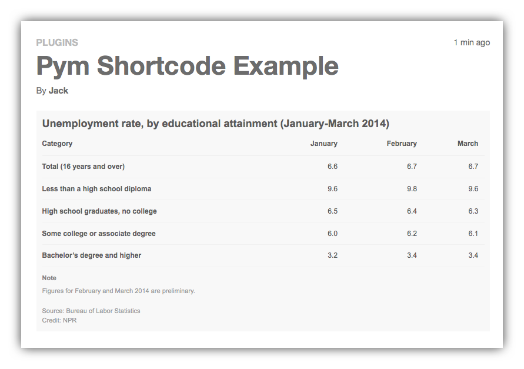
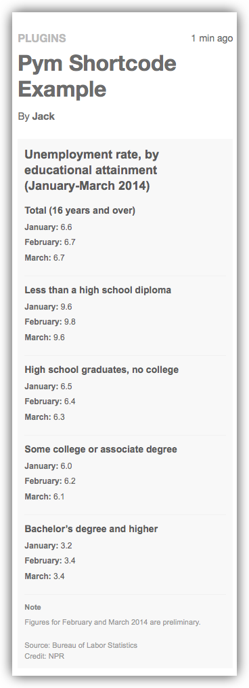

# Pym Shortcode

Pym Shortcode will responsively resize an iframe's height depending on the width of its container. The plugin uses [Pym.js](http://blog.apps.npr.org/pym.js/), developed by the [NPR Visuals Team](http://blog.apps.npr.org/), to allow embedded content in WordPress posts and pages using a simple shortcode. Using `Pym.js`, it bypasses the usual cross-domain issues.

## Plugin Installation

1. In the WordPress Dashboard go to **Plugins**, then click the **Add Plugins** button and search the WordPress Plugins Directory for Pym Shortcode. Alternatively, you can download the zip file from this Github repo and upload it manually to your WordPress site.
2. Activate the plugin through the 'Plugins' screen in WordPress
3. Nothing to configure, just begin using Pym Shortcode!

## Using Pym Shortcode

In a WordPress post or page use Pym Shortcode like this:

`[pym src="http://blog.apps.npr.org/pym.js/examples/table/child.html"]`

Example in a post:


Desktop view of the WordPress post with the NPR embed using Pym Shortcode:



Mobile view of the WordPress post with the NPR embed using Pym Shortcode:



## Options

```
[pym src="" pymsrc="" pymoptions="" class="" align=""]
```

`src` is the URL of the page that is to be embedded.

`pymsrc` is optional; only set this if you need to specify a different source for Pym.js than the default. The default pym source is `js/pym.src` in this plugin.

`pymoptions` is optional; this should be a javascript object without the surrounding `{}`, and is given in the event that options need to be passed to the `pymParent`. NPR gives [this example](http://blog.apps.npr.org/pym.js/#examples) javascript:

```js
pym.Parent('example', 'child.html', { xdomain: '*\.npr\.org' });
```

`class` is optional; this should be a CSS class name or space-separated series of CSS classes as you would apply them to an HTML element.

`align` is optional; this should be one of the [WordPress-provided generated alignment types](https://codex.wordpress.org/CSS#WordPress_Generated_Classes): `left`, `right`, `center`, `none`. If your theme supports the `wide` or `full` values, you can use those too, as the value provided here will be prefixed with `align` and output as a CSS class on the Pym parent, so that the shortcode `[pym align="foo"]` results in the output `<div id="pym_0" class="pym alignfoo ">...`

## Frequently Asked Questions

### Why would I want to use Pym in the first place?

Using iframes in a responsive page can be frustrating. It’s easy enough to make an iframe’s width span 100% of its container, but sizing its height is tricky — especially if the content of the iframe changes height depending on page width (for example, because of text wrapping or media queries) or events within the iframe. For more information, see [NPR's documentation for `Pym.js`](http://blog.apps.npr.org/pym.js).

### Why is a WordPress plugin needed to use `Pym.js`?

Normally WordPress strips out JavaScript inserted in posts and pages, so the usual HTML `Pym.js` embed code's `<script>` tag won't work. Pym Shortcode simply provides a wrapper around `Pym.js` so you can embed anything you'd use `Pym.js` for by using WordPress shortcode.

### When would I use a `Pym.js` solution versus embed code without using `Pym.js`?

If you're embedding a YouTube video or a SoundCloud audio player, you don't need `Pym.js` and in fact you would not want to use it. WordPress supports many embeds through [oEmbed](https://codex.wordpress.org/Embeds). To make these commodity types of embeds responsive, you may need to add CSS rules depending on your theme. They won't be resized by Pym Shortcode.

You would want to use Pym for other types of iframe content including tables, charts, and interactive elements. For example, news organizations often create data-driven visualizations that are hosted in another application and need to be iframed into their CMS.

For Pym Shortcode to work, `pym.v1.min.js` code must be on the "Child Page" which is the source of the content embedded in the shortcode. You can use Pym Shortcode to embed content from any page that is so enabled. For information on how to do this, see [NPR's `Pym.js` documentation](http://blog.apps.npr.org/pym.js/#examples).

### Is `Pym.js` or this plugin dependent on jQuery or any other library?

Nope, all the required JavaScript is self-contained in `pym.v1.min.js`. The shortcode will enqueue `pym.v1.min.js` when necessary. You will need to include `pym.v1.min.js` on the embedded page, however.

### Why would I want to change the `Pym.js` source URL?

There are several reasons why you might want to change the version of `Pym.js` used to embed a webpage. For example:

- The embedded page uses an older version of `Pym.js`
- The embedded page is loaded over HTTPS, so `Pym.js` must be loaded over HTTPS to communicate with the child
- The embedded page uses a modified version of `Pym.js`

In any of these cases, set the different version of `Pym.js` using the `pymsrc` option in the shortcode:

```
[pym src="http://blog.apps.npr.org/pym.js/examples/table/child.html" pymsrc="https://cdnjs.cloudflare.com/ajax/libs/pym/0.4.5/pym.min.js" pymoptions=""]
```

### I've set a different `pymsrc` option, but now I'm seeing a message in the console

If a post has multiple instances of the pym shortcode or block present, and between those different pym instances there are different source URLs for `pym.js` specified, then you should expect to see a message like the following in the browser's console when viewing that page:

> Hi Pym user! It looks like your post has multiple values for pymsrc for the blocks and shortcodes in use on this page. This may be causing problems for your Pym embeds."

If your server is running with [`WP_DEBUG` set to `true`](https://codex.wordpress.org/WP_DEBUG), then your server console will also contain a message like this:

```
PHP message: post 5 There are more than one pym source URLs set on this page! The list: array (
  0 => 'http://example.org/wp-content/plugins/pym-shortcode/js/pym.v1.min.js',
  1 => 'https://pym.nprapps.org/pym.v1.js',
)
```

To remedy this issue, take the following steps:

1. Make sure every `[pym]` shortcode in the page has the same `pymsrc=""` attribute
2. Make sure that every Pym Embed block on the page has the same URL set in the block settings for the "Pym.js URL" option.

If your post has a mix of Pym shortcodes and blocks, you'll need to make sure that both sets use the same thing.

### How do I serve `Pym.js` if the embedded page uses HTTPS and my site does not?

If the embedded page's domain has an SSL certificate and is loaded over HTTPS, and if your site is loaded over plain HTTP, then the Pym script on your page will not be able to talk to the Pym script in the embedded page. This can be fixed by making sure your site loads over HTTPS, or by specifying an alternate source for your Pym script.

The default pym source is `js/pym.v1.min.js` in this plugin's folder, served by whatever protocol your site is using. You can change the source by using the `pymsrc` parameter in the shortcode, for example an HTTPS-using CDN source like `https://pym.nprapps.org/pym.v1.min.js`:

```
[pym src="https://blog.apps.npr.org/pym.js/examples/table/child.html" pymsrc="https://pym.nprapps.org/pym.v1.min.js" pymoptions=""]
```

The URL provided above is the [official content delivery network (CDN) for Pym](http://blog.apps.npr.org/pym.js/#get-pym-cdn). If you're hosting your embed on an HTTPS domain, you can also host your copy of `Pym.js` there and use that URL.

### How do I know if there's an HTTPS problem with a given embedded iframe?

If the embed isn't resizing correctly (especially vertically), the `Pym.js` script may not be loading correctly.

You can determine if the embed is being served over HTTPS by opening the embed in new tab and looking at the protocol it's using. To open the embed in a new tab, try right-clicking on the embed and choosing "Open frame in new tab" or a similar option.

You can also check by opening your browser's developer tools and looking in the console for errors.

### What license is this plugin licensed under?

This plugin is released under the GNU GPL, version 2 or later.

`Pym.js`, included in this plugin, is [released under the MIT open source license](https://github.com/nprapps/pym.js/tree/master#license-and-credits).

## Other Pym Resources

You may also want to look at NPR's `Pym.js` resources, especially if you're interesting in building compatible embeds:

* [`Pym.js` homepage](http://blog.apps.npr.org/pym.js/)
* [`Pym.js` repo on GutHub/nprapps](https://github.com/nprapps/pym.js/)
